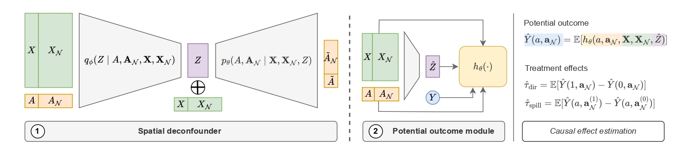

# Spatial Deconfounder: Interference-Aware Deconfounding for Spatial Causal Inference 

The Spatial Deconfounder uses a conditional variational autoencoder (CVAE) with a spatial Laplacian prior to recover a smooth substitute confounder from local treatment patterns, addressing both interference and unobserved confounding.



## Requirements

To download the necessary requirements:
```
conda env create -f environment.yml
conda activate spacedata
```

## Synthetic Data Generation wth Interference

It only supports one GPU for training right now. To generate the data:
```
cd space-data
snakemake -j --configfile conf/pipeline.yaml
```

## Run Benchmarks

Change files in `benchmarks/conf/` to change resources, algorithms, datasets, hyperparams, etc.. The outputs are `jsonl` fles. To run the `pipeline.yaml` file, run:

```
PYTHONPATH=. snakemake --configfile benchmarks/conf/pipeline.yaml --use-conda --cores all
```

